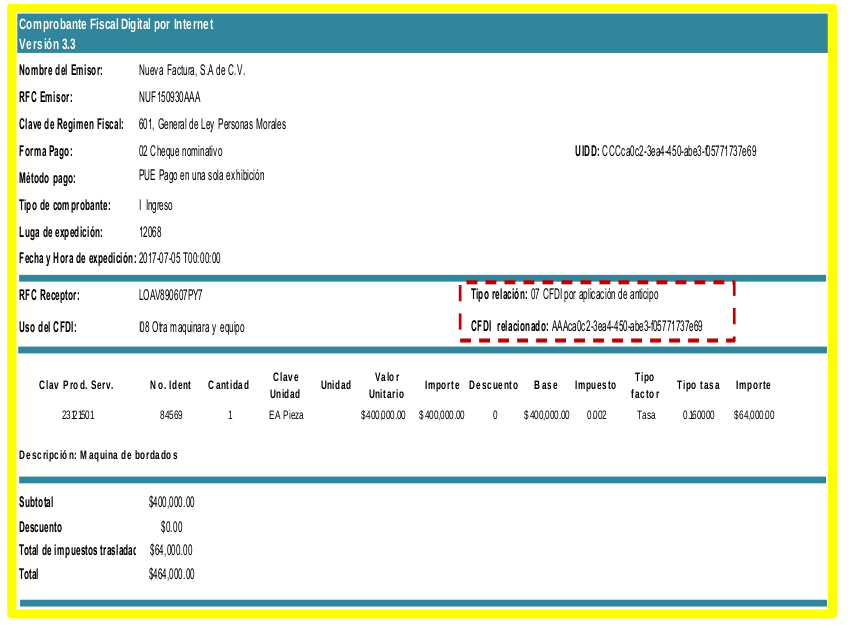

## Reportes Módulo de Caja

### Corte de Caja

|Descripcion|Archivo|
|:---|---:|
|[Resumen de Ventas](#corte-de-caja---resumen-de-ventas)  			|  [corte-caja-02-resumen-de-ventas.rpt](./files/corte-caja-02-resumen-de-ventas.rpt)
|[Movimientos Cancelados](#corte-de-caja---movimientos-cancelados)	|  [corte-caja-13-movimientoes-cancelados.rpt](./files/corte-caja-02-resumen-de-ventas.rpt)

### Corte de Caja - Resumen de Ventas

Muestra las ventas del corte clasificadas por impuesto.

[Descargar Reporte](./files/corte-caja-02-resumen-de-ventas.rpt)

Los reports son
- adsasdasd lajshdlajsd laksd jasdj a
- alkdsj lakdj lajsd lasjd lajsd
- lakj lajsd lajsd lajsd lasjd
- lja slj dlj saldkj asldj asdlja
- lkj alsj lkj dlja dslkja sd
- lj asldkjsa dlkajs dlkasd j

### Corte de Caja - Movimientos Cancelados

Muestra los facturas y notas canceladas del corte

